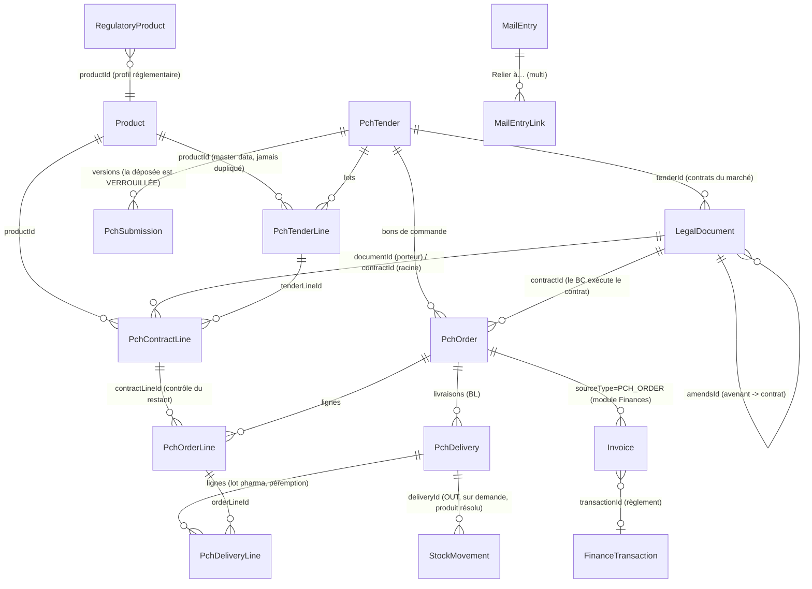
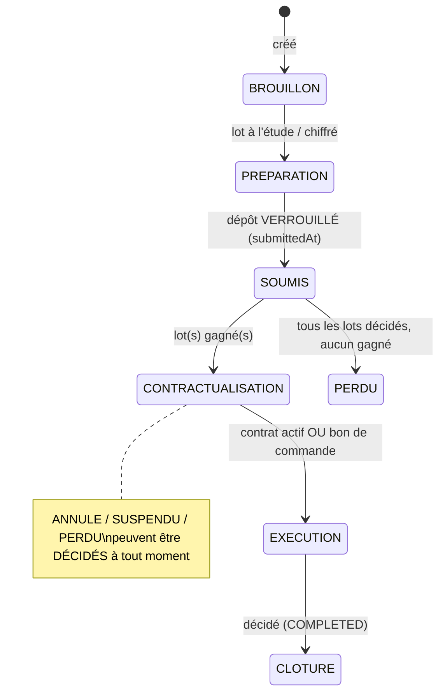

# Market / Tender 360° — Architecture

> Un appel d'offres devient un **dossier transversal de bout en bout** : cahier des charges →
> soumission → attribution → contrat → avenants → bons de commande → livraisons → factures →
> paiements → clôture — relié nativement à Regulatory, Legal, Drive, Courriers, Finance,
> Logistique, Stocks, Ad&Pro, force de vente, budget, tâches, notifications, recherche, audit
> et Adam. **Un seul graphe d'entreprise, plusieurs vues métier.**

---

## 0. AUDIT DE L'EXISTANT — la carte, avant la première table

L'audit a précédé toute écriture. Constat central : **l'ERP contient déjà les deux tiers du
graphe demandé**, souvent sous une forme que la mission décrit comme « à créer ». La stratégie
retenue est donc l'EXTENSION, jamais la duplication.

### 0.1 Réutilisable tel quel (ne pas recréer)

| Besoin de la mission | Ce qui existe déjà | Où |
| --- | --- | --- |
| Produit = master data, jamais dupliqué | `Product` canonique (code PRD-, `identityKey` unique, tuple DCI/dosage/forme/packaging) relié à `RegulatoryProduct`, `PromoProduct`, `BdProduct`, lignes d'AO, ventes, visites, Ad&Pro, affectations | `prisma/schema.prisma`, `src/lib/products/` |
| TenderLine → Product | `PchTenderLine.productId → Product` (FK, nullable car un AO nomme des produits qu'on ne porte pas ; `designation` du marché fait foi juridiquement) | schéma |
| Affectation commerciale historisée (§33-34) | `ProductAssignment` : rôle (DELEGATE/PM/NS/SUPERVISOR), `territory`, `startedAt`/`endedAt`, `allocationPct` — exactement le `CommercialAssignment` demandé | schéma |
| BU ↔ produits ↔ équipes | `BusinessUnit` → `PromoProduct[]`, `SalesTeam[]` ; `PromoCycle` + `PromotionAssignment` (P1/P2/P3, visites planifiées) | module SFE |
| Ad&Pro ↔ produits (± marché) | `AdProProductAllocation` (part % ou montant, `tenderLineId` facultatif) — la distinction analytique/causal du §37 est déjà dans le modèle | schéma |
| Ventes ↔ marché | `Sale.tenderLineId` (« la chaîne PCH, quand la vente en relève ») + `Sale.productId` | schéma |
| Documents sans duplication | `Document(entityType, entityId, category)` + Drive (`DriveNode`, blobs, versions) ; l'écran PCH téléverse déjà avec `entityType="PCH_TENDER"` | `components/documents/` |
| Courrier → objet métier | `MailEntry.sourceType/sourceId` (+ `source-link.ts`, la carte des sources navigables, `PCH_TENDER` inclus) | `lib/links/source-link.ts` |
| Chaîne devis → BC → facture → règlement | `LegalDocument.chainFromId` (+ `chainOf` pur testé, validateurs par maillon, règlement via `expenseOrderId` → centre de paiement) | `lib/queries/legal-chain.ts` |
| Contrat partagé PCH/Legal | `LegalDocument` kind `CONTRACT` avec lecteurs, renouvellement, Drive, échéances, rappels — il manque seulement le LIEN FORT au marché (aujourd'hui : recherche par texte de référence) | module Legal |
| Facture + règlement Finance | `Invoice` (statuts UNPAID/PARTIAL/PAID, `sourceType/sourceId`, `transactionId → FinanceTransaction` — toute sortie/entrée d'argent passe par Finances) | module Finances |
| Mouvements de stock produits | `StockMovement.productId → RegulatoryProduct`, direction IN/OUT, lieu | module Stocks |
| Timeline consolidée du marché (§28) | **`storyMarche`** : frise hiérarchique (BC ⊃ livraison ⊃ facture ⊃ paiement), fils par produit, TROUS affichés (`etat: "manque"`), KPI attribué/commandé/livré/encaissé, provenance par jalon — déjà servie à Adam par `business.story` | `lib/queries/story.ts` |
| Tâches liées (§52) | `Task.relatedEntityType/relatedEntityId` + circuit demande/acceptation | schéma |
| Workflows (§51) | `ValidationRequest`/`ValidationStep` (séquentiel/parallèle, self-approval géré) + `WorkflowDefinition`/`WorkflowInstance` (par catégorie, versions, champs personnalisés) | moteurs existants |
| Notifications | `notifyUser`/`notifyRoles` + push + routage par module | `lib/notify.ts` |
| Recherche globale (§44) | `search-everything` couvre déjà legal, invoices, orders, mails, payments… | `lib/queries/search-everything.ts` |
| Audit trail (§62) | `AuditLog` + `recordAudit` + `BusinessEvent` (registre canonique §17) | plateforme |
| Adam (§54) | `business.story` (ancre = référence de marché OU produit), `inspect_record`, `search_everything`, 485 ops | contrat de plateforme |
| Lecture IA du cahier des charges (§12) | `extractAndSaveLines` → `enrichLineById` → `analyzeMolecule` : lots extraits, produits rapprochés, JAMAIS de création silencieuse | `lib/actions/pch-tender-line-actions.ts` |

### 0.2 À étendre

| Objet | Manque mesuré | Extension |
| --- | --- | --- |
| `PchTender` | Pas de deadline, pas de date de soumission (la frise le DIT : « la date de soumission n'est pas enregistrée : jalon déduit »), pas de responsable, pas de BU, pas de réf. interne, statuts pauvres (4) | `publishedAt`, `submissionDeadline`, `submittedAt`, `internalReference`, `responsibleId`, `businessUnitId` + statuts `SUSPENDED`/`LOST` ; le **niveau de vie complet est DÉRIVÉ** (même doctrine que le niveau de process Regulatory) |
| `PchTenderLine` | Attribution = booléen prix ; **aucune quantité attribuée** (l'attribution partielle du §14 est irreprésentable) ; pas de snapshot de NOTRE produit au dépôt (§9) | `awardedQuantityUnits`, `submittedQuantityUnits`, `submissionSnapshot Json` + statuts `UNSUCCESSFUL`/`CANCELLED` |
| `PchOrder` | Plat : une seule ligne (`lineId`), pas de rattachement contrat, livraison = deux champs de date | `contractId` (FK LegalDocument) + table `PchOrderLine` (n lignes → ligne contractuelle) ; `lineId` conservé le temps de la bascule (précédent : `ourProductId`) |
| `LegalDocument` | Contrat retrouvé par TEXTE (« aucun rapprochement au jugé ») ; pas d'avenant typé, pas de delta financier, pas de lignes | `tenderId` (FK PchTender), kind `AMENDMENT`, `amendsId` (FK self), `amountDelta`, `signedAt`, `effectiveAt` + table `PchContractLine` |
| `StockMovement` | Aucun lien à une livraison de marché | `deliveryId` facultatif (FK `PchDelivery`) |
| `MailEntry` | UNE seule relation (`sourceType/sourceId`) ; §25 exige plusieurs | table `MailEntryLink` (multi-relations typées `EntityType`) |
| `EntityType` | Pas de `PCH_ORDER` (documents/tâches/validations sur un BC) | ajouté |
| `storyMarche` | Basée sur les champs plats de `PchOrder` et la recherche texte des contrats | branchée sur les nouvelles relations FK, sans changer son contrat de sortie |

### 0.3 Nouveaux objets (les seuls)

| Modèle | Rôle | Pourquoi rien d'existant ne suffit |
| --- | --- | --- |
| `PchSubmission` | Versions de préparation (Draft/Review/Final/**Submitted**), checklist, verrou logique de la version déposée (§13, §63) | Aucune notion de version de soumission nulle part |
| `PchContractLine` | Ligne contractuelle : qty + prix par produit, portée par le contrat OU par un avenant effectif (delta ±) — la valeur contractuelle COURANTE est calculée, jamais écrasée (§17-18) | `LegalDocument` n'a qu'un montant global |
| `PchOrderLine` | Ligne de BC → ligne contractuelle → produit (§19) | `PchOrder.lineId` = une seule ligne |
| `PchDelivery` + `PchDeliveryLine` | Livraisons multiples par BC : BL, dates, réserves, lots pharma, péremption (§20) | Deux champs de date sur le BC |
| `MailEntryLink` | « Relier à… » multiple des courriers (§25-27) | Une seule source par pli |

**Refusé (sur-ingénierie §89)** : un `EntityLink` polymorphe universel — les relations fortes
restent des FK typées ; le multi-lien n'est ajouté QUE là où le besoin est réel (courriers).
Refusé aussi : un second moteur de workflow, un second stockage documentaire, un objet
« ContratPch » distinct du contrat Legal (un seul objet, deux vues — §16, §64).

### 0.4 Relations posées (FK explicites, §29)

```
PchTenderLine.productId        → Product            (existant)
LegalDocument.tenderId         → PchTender          (nouveau — remplace la recherche texte)
LegalDocument.amendsId         → LegalDocument      (nouveau — avenant → contrat)
PchContractLine.documentId     → LegalDocument      (contrat OU avenant porteur)
PchContractLine.contractId     → LegalDocument      (contrat racine, pour l'agrégation)
PchContractLine.tenderLineId   → PchTenderLine
PchContractLine.productId      → Product
PchOrder.contractId            → LegalDocument
PchOrderLine.contractLineId    → PchContractLine
PchDelivery.orderId            → PchOrder
PchDeliveryLine.orderLineId    → PchOrderLine
StockMovement.deliveryId       → PchDelivery
Invoice.sourceType/sourceId    = PCH_ORDER          (mécanisme existant, valeur nouvelle)
MailEntryLink.entityType/Id    → tout objet navigable
```

### 0.5 Pages touchées

`/pch` (liste → filtres de cycle de vie), `/pch/[id]` (fiche 360° : en-tête + progression +
sections), `/regulatory/[id]` (vue « Marchés » du produit), `/legal/[id]` (contexte marché du
contrat), `/courriers` (« Relier à… »), navigation PCH (une entrée, pas d'arbre).

### 0.6 Migrations

SQL manuel **idempotent** (convention du dépôt), additif uniquement : nouvelles tables,
nouvelles colonnes nullables, nouvelles valeurs d'énumérés. **Backfill** : chaque `PchOrder`
portant un `lineId` reçoit sa `PchOrderLine` équivalente ; aucun champ existant n'est supprimé
ni réinterprété. Zéro donnée perdue, ancien code fonctionnel pendant la bascule.

### 0.7 Risques de régression

- `storyMarche` est consommée par Adam (`business.story`) : son contrat de sortie ne change pas,
  seule sa matière s'enrichit.
- `PchOrder.lineId` reste lu par l'écran logistique existant → conservé, backfillé, documenté.
- Les compteurs financiers passent de « champ plat » à « calcul de service » : un seul module de
  calcul (`lib/pch/market-math.ts`, pur, testé) pour éviter deux vérités (§24).
- Enum Postgres : valeurs AJOUTÉES seulement (jamais retirées) — pas de réécriture de données.

### 0.8 Dette technique détectée en chemin

- `PchTenderLine.ourProductId` (orphelin, pré-bascule `Product`) : encore présent, à purger
  dans un lot ultérieur une fois la parité vérifiée.
- `Invoice.transactionId @unique` : UN règlement par facture — le statut `PARTIAL` existe mais
  les paiements multiples ne sont pas modélisés côté Finance. Documenté comme limite (§23),
  non traité ici : restructurer Finance dépasse le périmètre et créerait le « mécanisme
  financier parallèle » que la mission interdit.
- La soumission déduite « lignes chiffrées » reste le repli pour l'historique antérieur aux
  `PchSubmission`.

---

## 1. Le modèle — un seul graphe, des vues (§84)



Le fil `Product → TenderLine → ContractLine → OrderLine → DeliveryLine` se remonte par
n'importe quel bout : `addOrderLine` recopie le `tenderLineId` de la ligne contractuelle sur
la ligne de BC précisément pour cela.

## 2. Le cycle de vie — DÉRIVÉ, jamais choisi

`src/lib/pch/market-math.ts` (pur, sans import, 22 tests) : les FAITS décident, seuls les
états DÉCIDÉS par un humain (annulé, suspendu, perdu, clôturé — posés dans « Modifier »)
viennent du statut stocké. `deriverNiveau` rend le niveau ET sa raison (l'infobulle de
l'en-tête, la liste `/pch`, la même règle partout).



## 3. Les calculs — un seul endroit (§24)

| Règle | Fonction | Consommée par |
| --- | --- | --- |
| Quantité/valeur attribuée (partielle §14) | `unitesAttribuees`, `valeurAttribuee` | fiche, liste, story, audit |
| Valeur contractuelle courante = initial + Σ deltas EFFECTIFS (§17-18) | `valeurContractuelleCourante` | fiche marché, fiche Legal, story |
| Quantités contractuelles par produit (deltas, clamp ≥ 0) | `quantitesContractuelles` | contrôle de BC |
| Contrôle de dépassement (refus chiffré, force tracé §19) | `controlerCommande` | `addOrderLine` |
| Niveau dérivé + raison | `deriverNiveau`, `etapeCourante` | en-tête, liste, badge |
| Zones d'échéance de dépôt (J-7/J-2/dépassé, anti-spam §53) | `zoneDepot`, `doitRappelerDepot` | `deadline-sweep` |

Écritures : `src/lib/actions/pch-market-actions.ts` — 16 actions serveur, transactionnelles
là où deux écritures racontent UN événement (dépôt+verrou+snapshots ; contrat+lignes ;
livraison+lignes+stock), toutes gardées (requireUser + userCan), toutes auditées.

## 4. Ownership (§85)

| Objet | Propriétaire | Les autres |
| --- | --- | --- |
| Produit | Regulatory (master data) | tous consomment par FK |
| AO, lots, soumission, BC, livraisons | PCH | Regulatory lit (vue Marchés), Adam lit |
| Contrat, avenants, lignes contractuelles | **UN objet, deux vues** : Legal instruit la pièce (LEGAL CREATE/UPDATE), PCH lit l'exécution | `createContractFromAward` exige les DEUX portes |
| Factures, règlements | Finances (`Invoice`, `sourceType=PCH_ORDER`) | le marché LIT, ne fabrique rien |
| Stock | Stocks (`StockMovement`) | la livraison ÉCRIT un mouvement OUT uniquement sur demande explicite ET produit résolu sans ambiguïté |
| Courriers | Registre (MailEntry) | liens multiples via `MailEntryLink`, création pré-associée depuis le marché |

## 5. Sécurité & intégrité (§49-50, §62-63)

- RBAC **serveur** dans chaque action ; la fiche masque, le serveur refuse.
- Soumission déposée : `lockedAt` — le refus de modification est SERVEUR (`loadEditableSubmission`).
- Dépassement contractuel : refus chiffré ; le passage en force est un geste explicite, audité
  avec son excès (« bloquer ferait saisir hors ERP »).
- Suppression d'une livraison : les mouvements de stock SURVIVENT (SetNull) et le reçu le dit.
- Audit : chaque geste passe par `recordAudit` ; résultat de lot = avant/après.

## 6. Adam (§54-55, §88)

- **Lecture** : `business.story` sert la MÊME frise que l'écran (storyMarche) — dépôt daté,
  attribution partielle, contrats par FK avec valeur courante, avenants effectifs, BL réels,
  factures Finances, manques affichés, limites dites.
- **Écriture** : 13 ops `pch_operation` natives (create/submit_submission, set_line_result,
  create_contract_from_award, link_contract, create_amendment, set_amendment_effective,
  add/delete_contract_line, add/delete_order_line, create/delete_delivery) + 2 ops
  `mail_operation` (link_record/unlink_record) — par les actions CANONIQUES, mêmes portes,
  même audit, proposition confirmée avant exécution.
- **Exclusions motivées** : cocher une pièce de la checklist de dépôt est une ATTESTATION
  signée (registre) — écran seulement, comme `fournirElementMission`.
- Parité mesurée après le chantier : **100 %** (0 trou), plafond de frontière ABAISSÉ 430 → 428.

## 7. Ce que le chantier n'a PAS fait (dette et limites, dites)

- Paiements MULTIPLES par facture : `Invoice.transactionId @unique` (1 règlement) — limite
  Finance documentée, hors périmètre (§23 interdit le mécanisme financier parallèle).
- `PchTenderLine.ourProductId` orphelin : à purger dans un lot dédié.
- E2E navigateur (Playwright §72) et revue visuelle systématique (§74) : NON couverts ici —
  la chaîne est prouvée par 9 tests d'intégration serveur (vraies actions, vraie base) et
  22 tests purs ; l'E2E navigateur reste à monter sur l'infra Playwright existante.
- L'historique d'avant les FK (contrats par texte, soumission déduite) reste servi en repli,
  marqué DÉDUIT.
